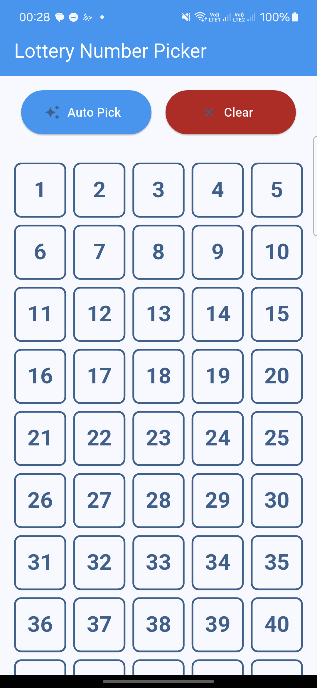
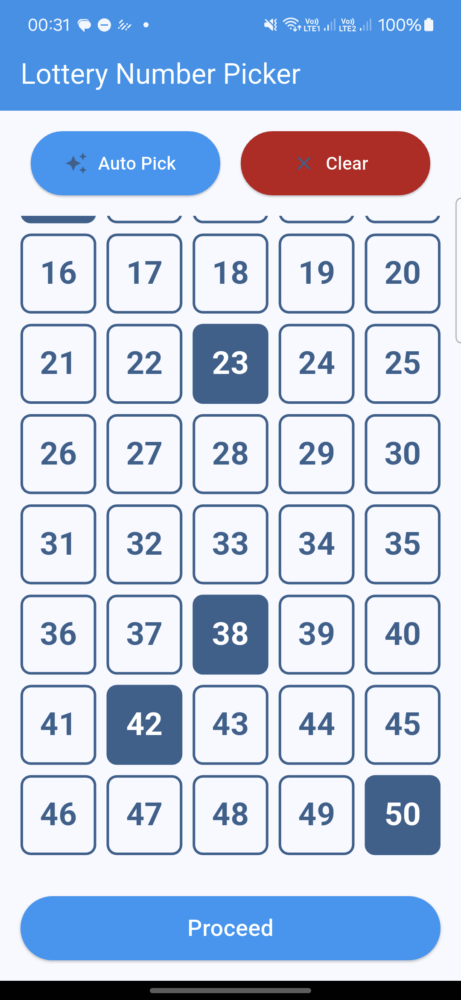
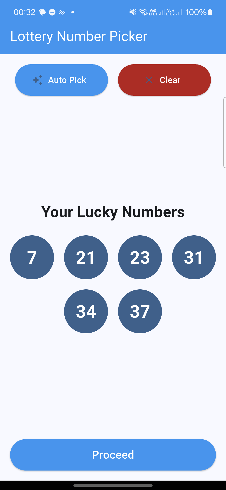
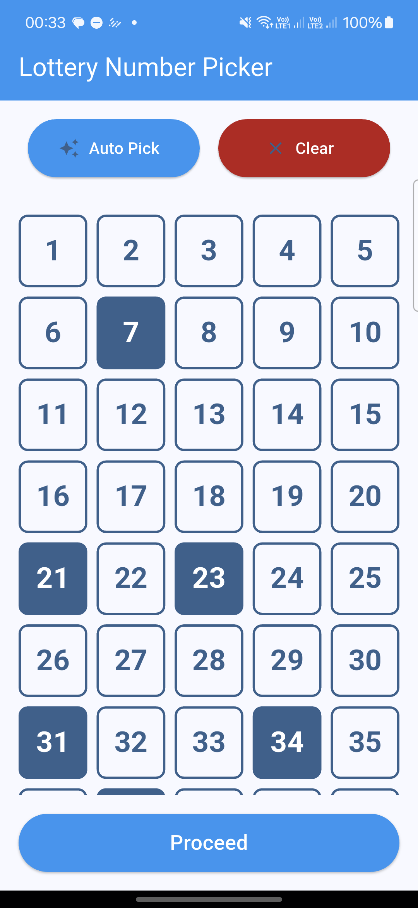

# Lottery Number Picker

A modern, animated Flutter application that allows users to select lottery numbers either manually or through an auto-pick feature. The app provides a smooth, intuitive interface with beautiful animations and a responsive design.

## Features

- **Manual Number Selection**
  - Interactive grid of numbers (1-50)
  - Select exactly 6 numbers
  - Visual feedback for selected numbers
  - Clear selection option

- **Auto-Pick Feature**
  - Generates 6 unique random numbers
  - Beautiful animation display
  - Smooth transition to grid view
  - Sorted number display

- **Modern UI/UX**
  - Material Design 3
  - Responsive layout
  - Smooth animations
  - Intuitive interface
  - Proper error handling
  - State management

## Screenshots

<div align="center">
  
  
  
  
</div>

## Video

https://github.com/WolfOf420Street/Lottery/blob/main/docs/media/videos/demo-video.mp4

*Click to watch the demo video showing the Lottery Number Picker in action*

## Getting Started

### Prerequisites

- Flutter SDK (version 3.0.0 or higher)
- Dart SDK (version 2.17.0 or higher)
- Android Studio / VS Code with Flutter extensions
- Git

### Installation

1. Clone the repository:
   ```bash
   git clone https://github.com/Wolfof420Street/Lottery.git
   cd Lottery
   ```

2. Install dependencies:
   ```bash
   flutter pub get
   ```

3. Run the app:
   ```bash
   flutter run
   ```

### Development Setup

1. **IDE Setup**
   - Install [Android Studio](https://developer.android.com/studio) or [VS Code](https://code.visualstudio.com/)
   - Install the Flutter and Dart plugins
   - Configure your IDE for Flutter development

2. **Device Setup**
   - For Android: Enable Developer Options and USB Debugging
   - For iOS: Install Xcode and set up iOS simulator
   - For Web: Enable web support in Flutter

3. **Project Structure**
   ```
   lib/
   ├── main.dart                 # Entry point
   ├── screens/                  # Screen widgets
   │   └── lottery_picker_screen.dart
   ├── widgets/                  # Reusable widgets
   │   ├── number_grid.dart
   │   └── auto_picked_numbers.dart
   └── theme/                    # Theme configuration
       └── app_theme.dart
   ```

## Usage

### Manual Number Selection
1. Launch the app
2. Tap numbers on the grid to select them
3. Select exactly 6 numbers
4. Use the "Clear" button to reset selection
5. Tap "Proceed" when ready

### Auto-Pick Feature
1. Tap the "Auto Pick" button
2. Watch the animated display of your lucky numbers
3. After 3 seconds, the numbers will transition to the grid
4. Review your numbers
5. Use "Clear" to try again or "Proceed" to continue

## Technical Details

### Architecture
- Uses Flutter's widget-based architecture
- Implements state management using StatefulWidget
- Follows Material Design 3 guidelines
- Responsive design using LayoutBuilder

### Key Components

1. **LotteryPickerScreen**
   - Main screen widget
   - Manages state and user interactions
   - Handles animations and transitions

2. **NumberGrid**
   - Displays the interactive number grid
   - Handles number selection
   - Responsive layout

3. **AutoPickedNumbers**
   - Displays auto-generated numbers
   - Implements animations
   - Smooth transitions

4. **AppTheme**
   - Centralized theme configuration
   - Material Design 3 implementation
   - Consistent styling

### Animations
- Fade and scale transitions for auto-picked numbers
- Smooth grid transitions
- Interactive feedback animations
- State transition animations

## Contributing

1. Fork the repository
2. Create your feature branch (`git checkout -b feature/AmazingFeature`)
3. Commit your changes (`git commit -m 'Add some AmazingFeature'`)
4. Push to the branch (`git push origin feature/AmazingFeature`)
5. Open a Pull Request

## Testing

Run the test suite:
```bash
flutter test
```

## Building for Production

### Android
```bash
flutter build apk --release
```

### iOS
```bash
flutter build ios --release
```

### Web
```bash
flutter build web --release
```

## Dependencies

- Flutter SDK
- Material Design 3
- No external dependencies required

## License

This project is licensed under the MIT License - see the [LICENSE](LICENSE) file for details.

## Acknowledgments

- Flutter team for the amazing framework
- Material Design team for the design system


## Contact

WolfOf420SStreet - [@Fbillionaire__](https://x.com/Fbillionaire__)

Project Link: [https://github.com/WolfOf420Street/lottery](https://github.com/Wolfof420Street/Lottery.git)


